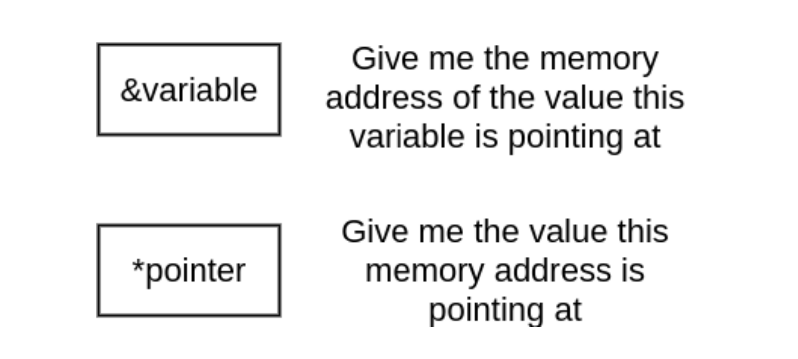

This post is for programmers coming to Go who are unfamiliar with the idea of pointers or a pointer type in Go.

### What is the variable?

](./asset-1.jpeg)

Let’s first understand what a variable is before we begin talking about pointer in Go. General speaking, when we write a program, we need to store some data or information in memory. The data is stored in memory at a particular address. Memory addresses are often represented with hex integer literals, such as **0x1234CDEF**

Now we need to know the address where it is stored. We can keep track of all the memory addresses where the data related to our program is stored. But imagine how hard to remember all those memory addresses in order to access data using them

That is the reason why we have a concept of variables.

](./asset-2.jpeg)

**_A variable just a convenient name given to a memory location where the data is stored._**

### What is the pointer?

A pointer is also a variable. **_But it’s a special kind of variable because the data that it stores is not just any primitives type such as integer or a string, it's a memory address of another variable_**_._

](./asset-3.jpeg)

In the above image, the pointer p contains the value 0x0001 which is the address of the variable a. And **_\*_**, **_&_** symbols meaning as a description in the image below, **_please remember it_**

### Why do we need pointers?

Let view an example firstly

<Embed src="https://gist.github.com/hiepndd/66c542c7f9ca388aadf546bd60684bc9.js" aspectRatio={0.357} />

The **double** function in the above example is expected to modify the input argument by doubling it. However, it fails. Why? Because of all value assignments, including function **_argument passing are value copying._** What the **double** function modified is a copy **x** of variable **a** but not variable **a**

One solution to fix the above double function is to let it return the modification result. This solution doesn’t always work for all scenarios. The following example shows another solution, by using a pointer parameter

<Embed src="https://gist.github.com/hiepndd/0c70d64bf7a2c4aeffb34af08bee61e2.js" aspectRatio={0.357} />

We can find that, by changing the parameter to a pointer type, the passed pointer argument **&a** and its copy **x** used in the function body both reference the same value, so the modification on **\*x** is equivalent to a modification on **\*p,** a.k.a., variable **a.** In other words, the modification in the **double** function body can be reflected out of the function now.

Surely, the modification of the copy of the passed pointer argument itself still can’t be reflected on the passed pointer argument. After the second **double** function call, the local pointer **p** doesn't get modified to **nil.**

### TL;DR

**_In short, pointers provide indirect ways to access some values. Many languages have not pointer concept. However_**, **_pointers are just hidden under other concepts in those languages_**

> Link reference

[**Go 101 - Go 101 (an online Go book + Golang knowledgebase)**  
_Go 101 is a book focusing on Go syntax/semantics and all kinds of details (Go 1.12 ready). This book also tries to help…_go101.org](https://go101.org/article/101.html "https://go101.org/article/101.html")

[**Playing with Pointers in Golang**  
_A pointer is a variable that stores the memory address of another variable. Confused? Let me explain. Let's first…_www.callicoder.com](https://www.callicoder.com/golang-pointers/ "https://www.callicoder.com/golang-pointers/")
